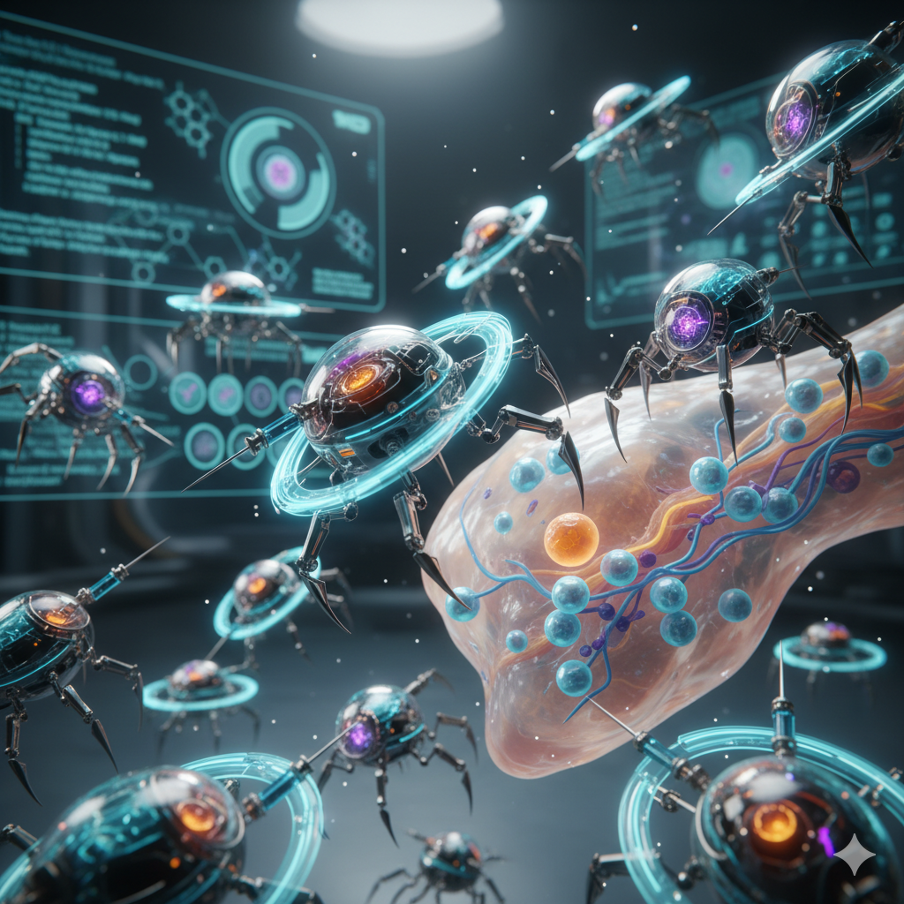

# nano-bot

> A turn-based AI programming competition set inside a simulated human body.

[](https://habitas-games.github.io/nano-bot/)
[](https://habitas-games.github.io/nano-bot/docs/participant_guide.html)
[](https://godotengine.org)
[](LICENSE)

**[Website](https://habitas-games.github.io/nano-bot/) · [Participant Guide](https://habitas-games.github.io/nano-bot/docs/participant_guide.html) · [Report a Bug](https://github.com/Habitas-Games/nano-bot/issues) · [Support](https://habitas-games.github.io/nano-bot/#support)**

---



---

## What is nano-bot?

nano-bot is a **head-to-head AI programming competition** built in **Godot 4**. 
Participants write a single GDScript strategy file that controls a fleet of nanobots 
navigating a grid of living tissue. Bots collect AZN energy molecules, claim **Habitas Points**, 
and outscore the opponent over 1 500 turns.

The simulation runs headless at hundreds of turns per second. A **visual map editor** lets you design 
custom tissue layouts with terrain, streams, spawn points, and resource nodes. A built-in replay viewer 
lets you scrub through every turn, inspect bots, zoom into the map, and watch event effects.

---

## Quick start — competing in 3 steps

### 1️⃣ Get Godot 4.6+

[**Download Godot**](https://godotengine.org/download) (free, open-source)

```bash
# macOS: brew install godot
# Linux: sudo apt-get install godot
# Or download the installer for your OS
```

📖 **[Full Godot setup guide →](GODOT_SETUP.md)** — detailed instructions for all platforms

### 2️⃣ Clone nano-bot

```bash
git clone https://github.com/Habitas-Games/nano-bot.git
cd nano-bot
```

### 3️⃣ Open & run in Godot

1. **Project Manager** → **Import** → select `nano-bot/` → **Import & Open**
   - Or from terminal: `godot --path .`
2. Click **▶ Play** (top-right) or press **F5**
3. In the game window: **Run Match** → watch the replay in the viewer

---

## Writing your strategy

1. Copy the example: `cp strategies/example_strategy.gd strategies/my_strategy.gd`
2. Edit `my_strategy.gd` — override two methods:

```gdscript
extends NanoStrategy

func choose_injection_point(map_info: MapInfo) -> Vector2i:
    return Vector2i.ZERO   # pick a spawn cell in your injection zone

func what_to_do_next(map_info: MapInfo, my_bots: Array) -> void:
    # Command your bots here
    for bot: BotProxy in my_bots:
        if bot.type == "NanoAI":
            bot.stop()
```

3. Run a match to test your strategy

📖 **[Full Participant Guide →](docs/participant_guide.html)** — complete API reference, scoring, bot stats, strategy tips

---

## Features

| | |
|---|---|
| 🧬 **Biological map engine** | Tissue density, bloodstream currents, and bone barriers create rich tactical terrain |
| 🤖 **8 programmable bot types** | Scouts, collectors, walls, needles, blockers — build a fleet from a 150 AZN budget |
| ▶️ **Full replay viewer** | Scrub all 1 500 turns, zoom the grid, inspect bots, watch event VFX |
| ⚡ **Headless runner** | CLI mode runs matches without the editor for fast iteration |
| 🏆 **Tournament bracket** | Drop strategies in `strategies/` and run a round-robin automatically |
| 🎯 **One-file API** | Your entire strategy is a single `.gd` file — two methods to override |
| 🔧 **Built in Godot 4** | Free, open-source engine. GDScript is Python-like and beginner-friendly |

---

## Bot types

| Bot | Cost | Role |
|---|---|---|
| **NanoAI** | Free | Command unit — the only one that can build other bots |
| **NanoCollector** | 20 AZN | Collects and delivers AZN; light attack (range 12) |
| **NanoContainer** | 25 AZN | High-capacity storage for long supply chains |
| **NanoNeedle** | 40 AZN | Stationary implant that claims a Habitas Point and scores |
| **NanoExplorer** | 15 AZN | Density-immune scout — same speed everywhere |
| **NanoIPCreator** | 30 AZN | Creates a new injection point mid-map |
| **NanoBlocker** | 20 AZN | Adds +6 turns to every enemy step through its cell |
| **NanoWall** | 25 AZN | Fully blocks enemy movement; auto-destructs in 50 turns |

---

## Scoring

A **NanoNeedle** placed on a Habitas Point scores every turn:

```
score = 20 + 2 × azn_stored   (when azn_stored > 0)
score = 5                      (needle planted but empty)
score = 0                      (no needle on the point)
```

Scores are recalculated from live state each turn — not accumulated. The highest score at turn 1 500 wins.

---

## Project structure

```
nano-bot/
├── index.html               ← project landing page
├── README.md                ← this file
├── GODOT_SETUP.md          ← Godot installation & setup guide
├── CONTRIBUTING.md          ← guidelines for bugs, features, PRs
├── DEPLOY.md               ← GitHub Pages deployment guide
├── docs/
│   ├── participant_guide.html   ← full API reference & strategy guide
│   ├── requirements.md          ← project specification
│   └── project_nanobot_reference.md  ← historical context
├── strategies/
│   └── example_strategy.gd  ← starter template (copy this)
├── src/
│   ├── api/                 ← public API (NanoStrategy, BotProxy, MapInfo, …)
│   ├── core/                ← simulation engine
│   └── ui/                  ← playback viewer and HUD
├── maps/
│   └── simple_tissue.json   ← default 50×50 map
├── assets/                  ← sprites, tiles, markers, VFX
├── data/
│   └── bot_types.json       ← bot stats
└── project.godot            ← Godot project configuration
```

---

## Running headless (command-line)

For fast iteration without opening the editor:

```bash
# Run a single match
godot4 --headless --path . -- \
    --map maps/simple_tissue.json \
    --strategy_a strategies/my_strategy.gd \
    --strategy_b strategies/example_strategy.gd \
    --out replays/my_match.json

# Run tests
godot4 --headless -s test_sim.gd
godot4 --headless -s test_full_gui_path.gd
```

---

## Contributing

Contributions are welcome — bugs, features, maps, or new example strategies.

- **Bug report** → [open an issue](https://github.com/Habitas-Games/nano-bot/issues/new?template=bug_report.md)
- **Feature request** → [open an issue](https://github.com/Habitas-Games/nano-bot/issues/new?template=feature_request.md)
- **Pull request** → fork, branch, and open a PR
- **New strategy** → add it to `strategies/` and open a PR

See [CONTRIBUTING.md](CONTRIBUTING.md) for detailed guidelines.

---

## Technology

| Component | Tech |
|---|---|
| **Engine** | [Godot 4.6+](https://godotengine.org/) (free, open-source) |
| **Language** | [GDScript](https://docs.godotengine.org/en/stable/tutorials/scripting/gdscript/) (Python-like) |
| **Simulation** | Turn-based, headless-capable |
| **Replay format** | JSON |
| **Viewer** | Built-in Godot UI with pan, zoom, event VFX |

📖 **[GDScript Documentation](https://docs.godotengine.org/en/stable/tutorials/scripting/gdscript/)**

---

## Support

nano-bot is built and maintained as a side project. If it's been useful to you:

- ⭐ **Star this repo** — helps others discover the project
- 💖 **[GitHub Sponsors](https://github.com/sponsors/mnavas)** — monthly or one-time
- 💳 **[PayPal](https://paypal.me/warionv)** — one-time contribution
- 🏦 **De Una (Banco Pichincha)** — Ecuador-based banking option

---

## License

MIT — see [LICENSE](LICENSE) for details.

---

## Getting help

- 📖 **[Participant Guide](docs/participant_guide.html)** — full API reference, scoring, strategy tips
- 📘 **[Godot Setup](GODOT_SETUP.md)** — installing Godot and getting started
- 🛠️ **[Contributing](CONTRIBUTING.md)** — guidelines for bug reports and PRs
- 🐛 **[Issues](https://github.com/Habitas-Games/nano-bot/issues)** — report bugs or request features
- 📚 **[GDScript Docs](https://docs.godotengine.org/en/stable/tutorials/scripting/gdscript/)** — learn the language
